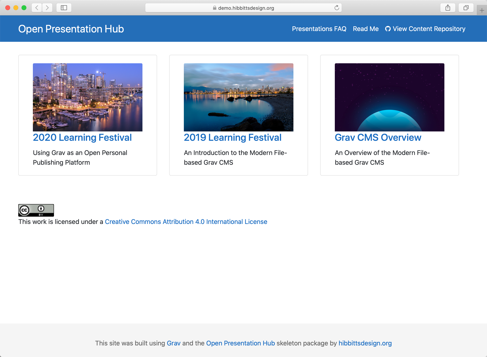
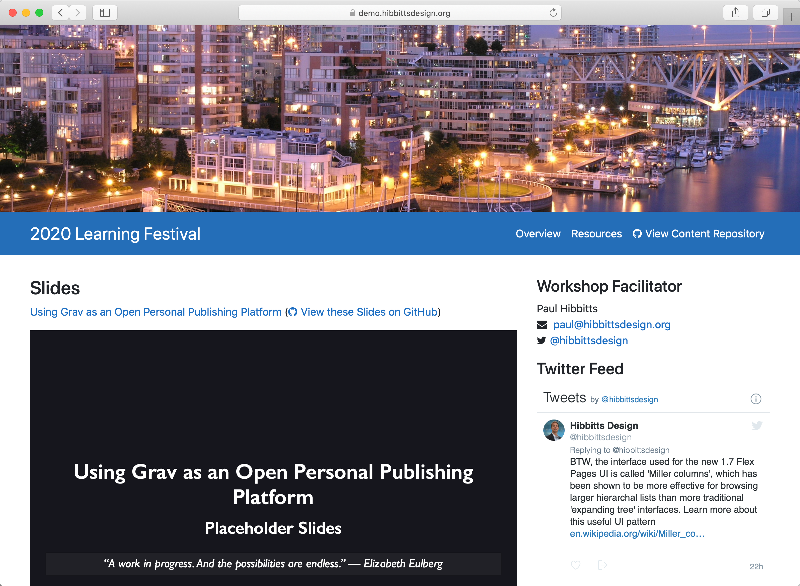

# Open Presentation Hub

[Grav Open Presentation Hub](https://github.com/hibbitts-design/grav-skeleton-presentation-hub) with [Git Sync](https://github.com/trilbymedia/grav-plugin-git-sync) is designed to help create and host Markdown-based slides created with Ole Vik's [Presentation](https://github.com/OleVik/grav-plugin-presentation) Plugin, which uses the [Reveal.js Presentation Framework](https://revealjs.com/#/). Built with the open source modern file-based [Grav CMS](http://getgrav.org).

Explore a sample Open Presentation Hub site at [demo.hibbittsdesign.org/grav-skeleton-open-matter-presentation-hub-site](https://demo.hibbittsdesign.org/grav-skeleton-open-matter-presentation-hub-site/)

[Download Open Presentation Hub](http://hibbittsdesign.org/blog/downloads/grav-skeleton-open-matter-presentation-hub-site.zip?classes=button)
